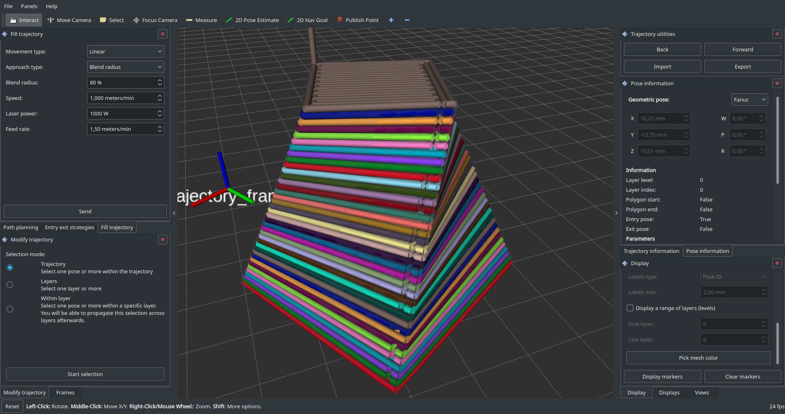
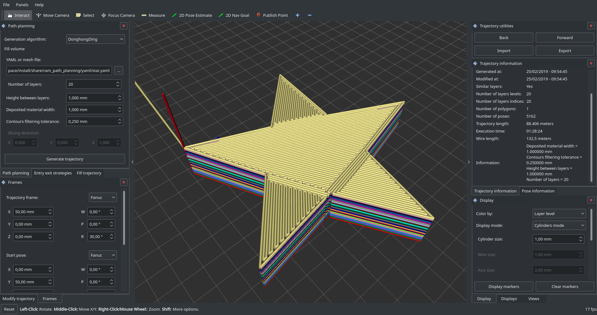
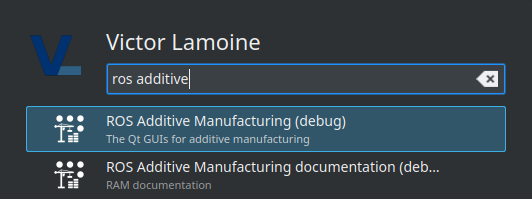

[](http://www.institutmaupertuis.fr)

# Overview
This repository is part of the [ROS-Industrial](https://wiki.ros.org/Industrial) program.

**R**OS **A**dditive **M**anufacturing (RAM) provides a set of tools (mostly algorithms and GUIs) to help end users create complex trajectories for additive manufacturing. The project is especially focused on printing metallic parts with industrial robots. This project contains multiple tools: path planning algorithm able to generate complex trajectories, visualisation tools, editing tools, etc.

:information_source: As of today this project aims at generating a robot program specific to the robot brand you use, and then upload/run the program on the robot. It's not designed to directly control your robot, though it would be possible quite easily.

# Documentation (french)
https://institutmaupertuis.gitlab.io/ros_additive_manufacturing/

# Media
https://www.youtube.com/watch?v=6U0zRbDbjQs





# Dependencies
## Robot Operating System
[Install](http://www.ros.org/install/) ROS Melodic

## Sphinx and Latex
```bash
sudo apt update
sudo apt install -y python-pip latexmk texlive-base texlive-latex-recommended texlive-fonts-recommended texlive-latex-extra
sudo pip install --no-cache-dir sphinx==1.7.4 sphinx_rtd_theme
```

## Visualisation ToolKit
You need VTK 8.0.0 or higher in order to compile this project.

Here are quick steps to download, compile and install VTK latest release:

```bash
sudo apt install -y libglew-dev libxt-dev libqt5x11extras5
mkdir -p $HOME/libraries/VTK-8.1/build_release
cd $HOME/libraries/VTK-8.1/
wget http://www.vtk.org/files/release/8.1/VTK-8.1.0.zip
unzip VTK-8.1.0.zip
mv VTK-8.1.0 src
cd build_release
cmake ../src -DCMAKE_BUILD_TYPE=Release
make -j4
```

Install with:
```bash
sudo make -j4 install
sudo ldconfig
```

## wstool
Install [wstool](https://wiki.ros.org/wstool).

## rosdep
Install, initialize and update [rosdep](https://wiki.ros.org/rosdep).

# Clone
```bash
mkdir -p catkin_workspace/src
cd catkin_workspace/src
git clone https://gitlab.com/InstitutMaupertuis/ros_additive_manufacturing.git
cd ..
wstool init src src/ros_additive_manufacturing/ros_additive_manufacturing.rosinstall
```

## Resolve ROS dependencies
```bash
rosdep install --from-paths src --ignore-src --rosdistro $ROS_DISTRO -y
```

## Compile and install
```bash
catkin_make install
```

# Launching
Source the catkin workspace and run:
```bash
roslaunch ram_qt_guis gui.launch
```

## Launching installed workspace
If you have installed the workspace then you can launch the application with your desktop application menu:



# Running the tests locally
The tests can be run locally with a GUI; for each package that allows that the commands are detailed in a README file; for example in [ram_path_planning/README.md](ram_path_planning/README.md)

Please check inside the repository if there is a `README` file in the package you are interested in testing!
