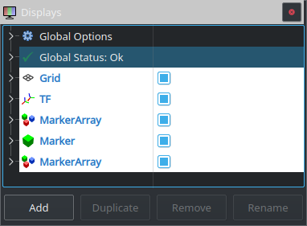

========
Displays
========

Cette fenêtre gère l’affichage général de RViz, elle permet par exemple de désactiver la grille, les axes ou l’affichage de la trajectoire. On peut ajouter des affichages en appuyant sur ``Add``. Dupliquer en appuyant sur ``Duplicate``. En supprimer en appuyant sur ``Remove``.
