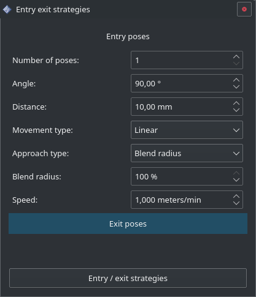
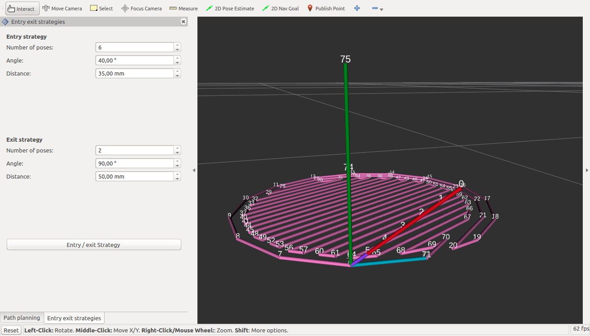

=========================
Entry and exit strategies
=========================

Entry strategy
==============
* **Number of poses:** Spécifie le nombre de poses d’entrée ajoutées.
* **Angle:** Spécifie l’angle d’attaque de la stratégie.
* **Distance:** Spécifie la distance du premier point d’entrée par rapport au premier point de la trajectoire.
* **Movement type:** Type de mouvement
* **Approach type:** Type d'approche
* **Blend radius:** Arrondi / lissage de la trajectoire
* **Speed:** Vitesse

Exit strategy
=============
Le comportement des paramètres est le même que pour l’entrée excepté qu’ils agissent à la fin de la trajectoire.

Exemple
=======

On peut voir sur l’image l’entrée de la trajectoire en rouge, le début du polygone en violet, la trajectoire en violet pâle, la fin du polygone en bleu pâle, et la sortie en vert.
Chaque nombre affiché en blanc correspond au numéro d’une pose, on peut donc voir qu’on a 6 poses en entrée et 2 poses en sortie.
Appuyer sur le bouton ``Entry / exit strategies`` ne fait qu’enregistrer les paramètres.
Il est nécessaire de régénérer la trajectoire pour prendre en compte ces modifications.
