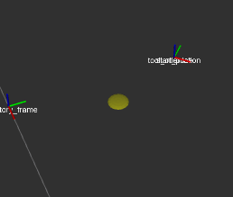
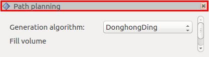

============
Introduction
============

Fenêtre principale
==================

.. image:: temp_static/introduction/gui.png
   :align: center
   :scale: 30 %

Le curseur jaune représente le centre de rotation, vous pouvez le déplacer et tourner autour.

Les commandes sont les suivantes:

* **Clic gauche enfoncé et mouvement de la souris:** Rotation autour du curseur.

* **Clic droit et mouvement de la souris ou molette:** Permet de zoomer/dé-zoomer autour du curseur.

* **Clic sur la molette et mouvement de la souris:** Permet de translater le curseur.

* **Touche** ``f`` **:** Viser un objet avec la souris et appuyer, cela permet de centrer le curseur sur l’objet visé.

Vous pouvez réorganiser les panneaux selon vos souhaits, pour cela maintenir le clic sur la partie grise en haut d’un panneau et le déplacer avec la souris. La partie rouge représente la zone à utiliser pour déplacer le panneau:

Vous pouvez utiliser le menu ``File > Save Config`` (``Ctrl`` + ``s``) lorsque la fenêtre RViz est active pour enregistrer la position des fenêtres ainsi que les paramètres de chacune d’entre elles.

Présentation des panneaux
=========================

La fenêtre est composée de plusieurs panneaux:

* :ref:`Path planning`

    Permet de choisir l’algorithme et de générer des trajectoires en utilisant les paramètres indiqués.

* :ref:`Entry and exit strategies`

    Défini les entrées/sorties de la trajectoire.

* :ref:`Fill trajectory`

    Contiens les paramètres du procédé par défaut sur la trajectoire (laser, WAAM, etc.).

* :ref:`Display`

    Permet de modifier l’affichage de la trajectoire.

* :ref:`Modify trajectory`

    Permet de modifier une trajectoire générée ou importée.

* :ref:`Frames`

    Permet de modifier les systèmes de coordonnées utilisés par le robot et la trajectoire.

* :ref:`Trajectory utilities`

    Permet d’annuler/rétablir des modifications sur la trajectoire et d’importer/exporter la trajectoire dans un fichier.

* :ref:`Pose information`

    Permet d’inspecter chaque pose de la trajectoire.

* :ref:`Trajectory information`

    Affiche des informations sur la trajectoire.

* :ref:`Displays`

    Permet de gérer l’affichage de RViz.

* :ref:`Views`

    Permet de gérer la vue dans RViz.

Définition d’une trajectoire de ROS Additive Manufacturing
==========================================================

Trajectoire
-----------

Elle est composée des informations suivantes:

* ``generated:`` La date à laquelle elle est générée.

* ``modified:`` La date de dernière modification.

* ``similar_layers:`` Permet d’identifier si toutes les couches de la trajectoire sont identiques ou non.

* ``poses:`` Objet contenant les :ref:`Poses` de la trajectoire.

* ``file:`` Fichier permettant de générer la trajectoire.

* ``generation_info:`` Chaîne de caractères contenant des informations sur la génération de la trajectoire.

Poses
-----

C’est un objet composant la trajectoire, il est créé par les informations suivantes:

* ``unique_id:`` Un identifiant unique.

* ``pose:`` Position et orientation dans l’espace de l’effecteur robot.

* ``layer_level:`` Le niveau de la couche.

* ``layer_index:`` L’index de la couche.

* ``polygon_start:`` Marque le début d’un polygone.

* ``polygon_end:`` Marque la fin d’un polygone.

* ``entry_pose:`` Marque un point d’entrée de la trajectoire.

* ``exit_pose:`` Marque un point de sortie de la trajectoire.

* ``params:`` Objet contenant les :ref:`Paramètres` (procédé) de la pose.

Paramètres
----------

Ces paramètres sont définis pour chaque pose de la trajectoire:

* ``movement_type:`` Type de mouvement robot (articulaire ou linéaire).

* ``approach_type:`` Spécifie le comportement du robot sur les points de passage (arrêt du robot ou lissage de la trajectoire).

* ``blend_radius:`` Dans le cas où la trajectoire est lissée, spécifie la quantité de lissage (la signification de cette valeur dépend du robot utilisé).

* ``speed:`` Spécifie la vitesse de l’effecteur.

* ``laser_power:`` Spécifie la puissance du laser.

* ``feed_rate:`` Spécifie le débit de matière (vitesse du fil, débit de poudre, etc.)
