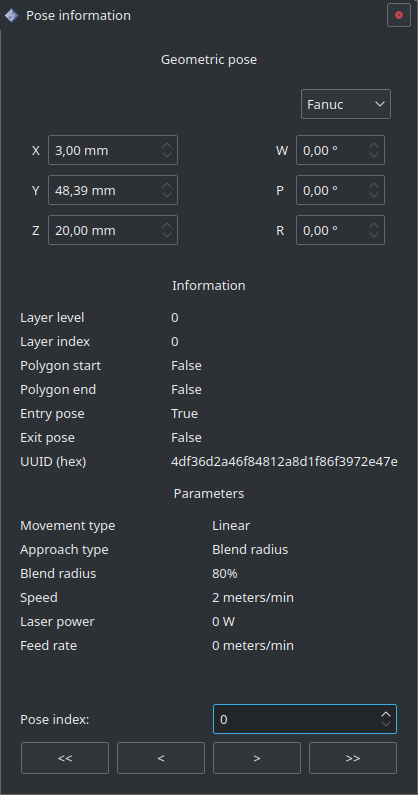

================
Pose information
================

Cette fenêtre référence toutes les informations sur les poses définies dans :ref:`Poses`.

``Pose index`` fait référence aux étiquettes affichées par l'option ``Display labels`` du panneau :ref:`Display`.

Pour naviguer dans les poses, modifier la valeur du champ ``Pose index`` (en entrant une valuer ou avec la molette de la souris).
Les boutons en bas de la fenêtre permettent de naviguer dans les poses; les boutons aux extrémités permettent d'atteindre le début et la fin de la trajectoire, ceux aux centre le début ou la fin de la couche.

Pour chaque pose en plus de son ``Pose index`` l'identifiant unique (``UUID``) est affiché en hexadécimal (base 16).
