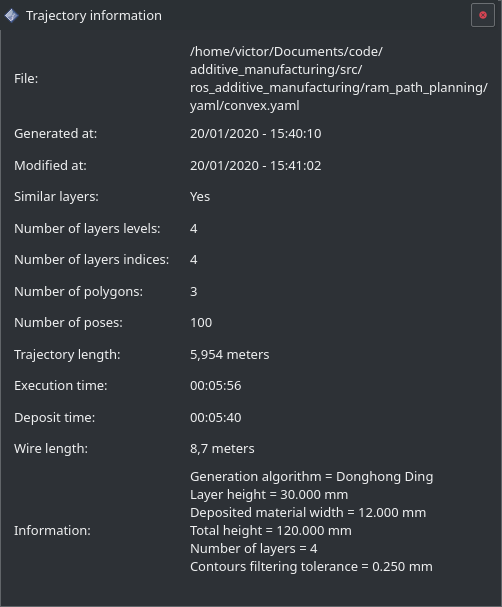

======================
Trajectory information
======================

Cette fenêtre référence toutes les informations sur les poses définies dans :ref:`Trajectoire` avec quelques informations supplémentaires:

* **Number of polygons:** Le nombre de polygones.
* **Number of poses:** Nombre de poses dans la trajectoire.
* **Trajectory length:** La longueur de la trajectoire en mètres.
* **Execution time:** Estimation du temps nécessaire à la réalisation de la pièce, ne tient pas compte des accélérations du robot.
* **Deposit time:** Estimation du temps de dépose (exclu les mouvement sans apport fil/poudre), ne tient pas compte des accélérations du robot.
* **Wire length:** Estimation de la longueur du fil qui sera utilisée en mètres.
* **Information:** Informations remplies par :ref:`Path planning` lors de la génération de la trajectoire.
