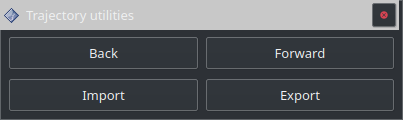

====================
Trajectory utilities
====================

Cette fenêtre fournit 4 options:

* **Back:** Cette option permet de revenir sur l’état précédent de la trajectoire (exemple: annuler une modification). Il est possible d'utiliser cette option dès le démarrage du logiciel pour charger la dernière trajectoire utilisée.
* **Forward:** Permet de revenir en avant si un retour en arrière a été effectué avec ``Back``.
* **Import:** Permet d’importer une trajectoire depuis un fichier ``.bag`` sur le disque.
* **Export:** Permet d’exporter une trajectoire vers un fichier ``.bag`` sur le disque.
